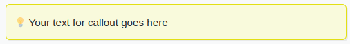
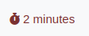

# Schmucklos

A fast, minimal, responsive [Hugo](https://gohugo.io/) theme for blogs, forked from [devise](https://themes.gohugo.io/devise)

To see a live blog using it you can visit my blog:
- [shmulik-klein.github.io](https://shmulik-klein.github.io)

## Features
- Callout boxes shortcode
You can use it to create a callout on your posts:

```
 Your text for callout goes here {{ < /callout >}}
```



- Reading Time
Your posts includes by default the expected reading time



## Contributing

If you have an idea for a new feature or found a bug, please feel free to use Github
[issues](https://github.com/austingebauer/devise/issues) to let me know.

## License

[MIT](LICENSE)
